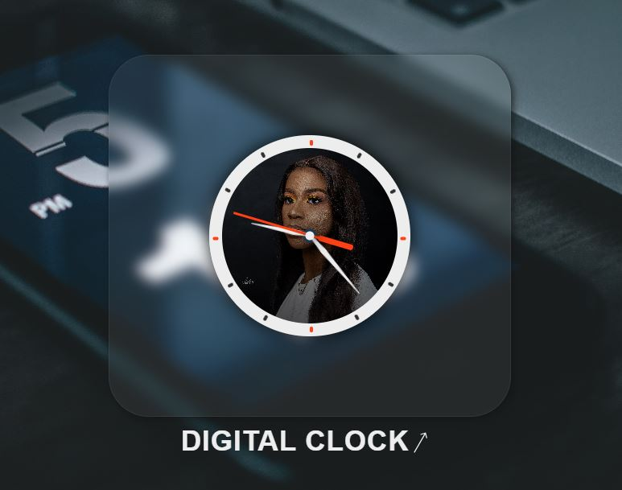

# Analog Clock

This is a simple analog clock built using HTML, CSS, and JavaScript. It displays the current time in a traditional analog format with hour, minute, and second hands on a circular clock face.

## Screenshot



## Link

Live link [here](https://web-analog-clock.netlify.app)


## Files

The project consists of the following files:

1. **index.html**: The HTML file contains the structure and layout of the clock.
2. **style.css**: The CSS file contains the styles and positioning for the clock elements.
3. **script.js**: The JavaScript file contains the logic to update the clock's hands based on the current time.

## How It Works

The analog clock is created by positioning the hour, minute, and second hands using CSS transforms and rotations. JavaScript is used to retrieve the current time and continuously update the clock's hands accordingly.

The `index.html` file sets up the basic structure of the clock, including the clock face and the hour, minute, and second hand elements.

The `style.css` file defines the styles for the clock elements. It positions the clock face at the center of the page and adjusts the position of the hands accordingly. It also sets up the styles for the hands, including their lengths, widths, and colors.

The `script.js` file contains the JavaScript code that drives the clock. It uses the `setInterval()` function to update the clock every second. Inside the function, it retrieves the current time using the `Date()` object and calculates the rotation angles for the hour, minute, and second hands. Finally, it applies these rotation angles to the corresponding hand elements using CSS transforms.

## Installation

To use the analog clock, follow these steps:

1. Clone the repository or download the source code.

```bash
git clone https://github.com/kizitech/Analog-Clock.git
```

2. Open the project folder.

```bash
cd Analog Clock
```

3. Open the `index.html` file in a web browser.

```bash
open index.html
```

Alternatively, you can also copy the HTML, CSS, and JavaScript code into separate files or integrate them into an existing project.

## Usage

Once you have the analog clock running in your web browser, it will start displaying the current time. The hour hand represents the current hour, the minute hand represents the current minute, and the second hand represents the current second.

You can customize the appearance of the clock by modifying the CSS code. For example, you can change the color, size, or style of the clock hands, or modify the clock face design.

The JavaScript code handles the logic of updating the clock hands every second. You can customize the behavior of the clock by modifying the JavaScript code. For example, you can add additional functionality such as displaying the current date or implementing different time zones.

## Customization

If you want to customize the appearance of the clock, you can modify the CSS styles in the `style.css` file. You can change the size, color, and positioning of the clock elements to suit your preferences.

## Compatibility

The analog clock is built using standard HTML, CSS, and JavaScript, so it should work on most modern web browsers.

## Credits

The digital clock project was developed by Ohani Kizito. Inspired by Apple iPhone Clock App.

## Author

If you encounter any issues or have any questions regarding the digital clock project, please feel free to contact the project author.

- LinkedIn - [Ohani Kizito](https://www.linkedin.com/in/ohanikizito/)
- Twitter - [Ohani_Kizito](https://www.twitter.com/Ohani_Kizito)# Analog-Clock
